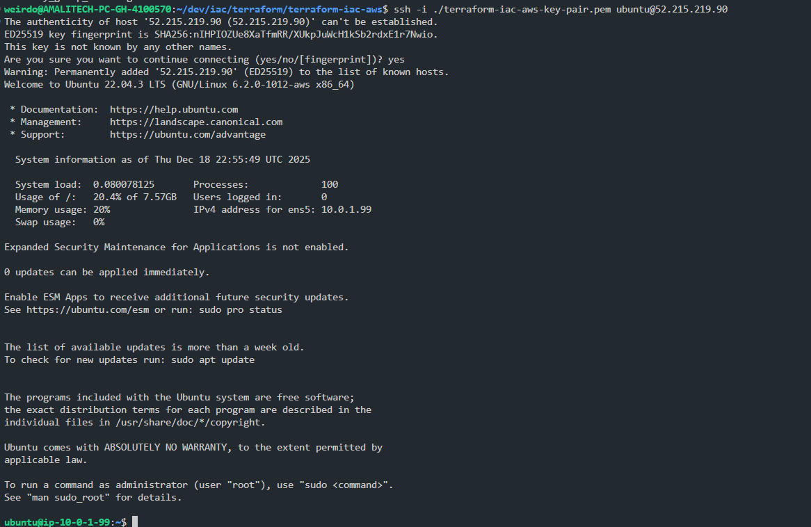
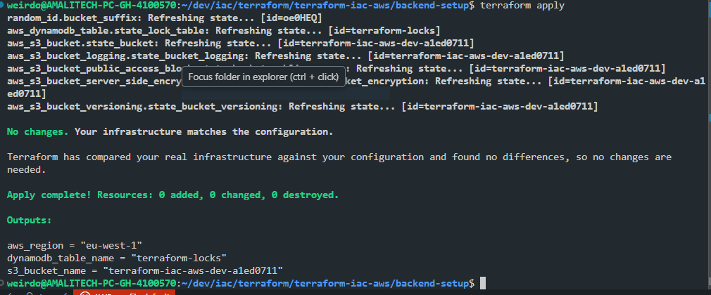
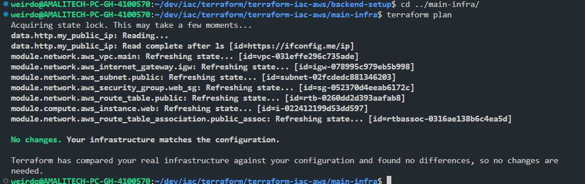
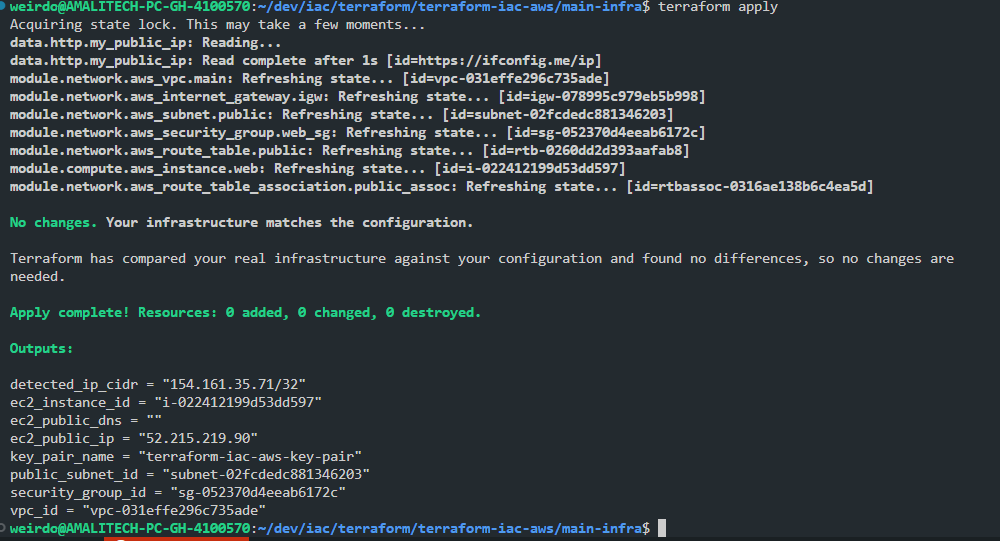

# Terraform AWS Infrastructure Project

This project uses Terraform to define and deploy foundational AWS infrastructure with a remote backend in Amazon S3 and DynamoDB state locking.

---

## Architecture Diagram

```
┌─────────────────────────────────────────────────────────────┐
│                         AWS Cloud                           │
│                                                             │
│  ┌─────────────────────────────────────────────────────┐    │
│  │                    VPC (10.0.0.0/16)                │    │
│  │                                                     │    │
│  │  ┌──────────────────────────────────────────────┐   │    │
│  │  │  Public Subnet (10.0.1.0/24)                 │   │    │
│  │  │                                              │   │    │
│  │  │  ┌────────────────────────────────────┐      │   │    │
│  │  │  │  EC2 Instance (t2.micro)           │      │   │    │
│  │  │  │  - Public IP                       │      │   │    │
│  │  │  │  - Ubuntu 22.04                    │      │   │    │
│  │  │  └────────────────────────────────────┘      │   │    │
│  │  │           │                                  │   │    │
│  │  │           │ Security Group                   │   │    │
│  │  │           │ - SSH (22) from Your IP          │   │    │
│  │  │           │ - HTTP (80) from 0.0.0.0/0       │   │    │
│  │  └──────────────────────────────────────────────┘   │    │
│  │                       │                             │    │
│  │                       │                             │    │
│  │           ┌───────────┴──────────┐                  │    │
│  │           │  Internet Gateway     │                 │    │
│  └───────────┴───────────────────────┴─────────────────┘    │
│                          │                                  │
│                          │                                  │
│              ┌───────────┴──────────┐                       │
│              │      Internet        │                       │
│              └──────────────────────┘                       │
│                                                             │
│  ┌─────────────────────────────────────────────────────┐    │
│  │           Backend Infrastructure                    │    │
│  │                                                     │    │
│  │  ┌──────────────────┐      ┌──────────────────┐     │    │
│  │  │  S3 Bucket       │      │  DynamoDB Table  │     │    │
│  │  │  - Terraform     │      │  - State Lock    │     │    │
│  │  │    State         │      │                  │     │    │
│  │  │  - Versioned     │      │                  │     │    │
│  │  │  - Encrypted     │      │                  │     │    │
│  │  └──────────────────┘      └──────────────────┘     │    │
│  └─────────────────────────────────────────────────────┘    │
└─────────────────────────────────────────────────────────────┘
```

---

## Project Structure

```
terraform-iac-aws/
├── backend-setup/          # S3 bucket and DynamoDB table for remote state
│   ├── main.tf
│   ├── variables.tf
│   ├── output.tf
│   └── providers.tf
├── main-infra/             # Main infrastructure deployment
│   ├── main.tf             # Module orchestration
│   ├── variables.tf        # Input variables
│   ├── outputs.tf          # Output values
│   ├── backend.tf          # Remote backend configuration
│   ├── providers.tf        # Provider configuration
│   ├── terraform.tfvars.example  # Example variables file
│   └── modules/
│       ├── network/        # VPC, Subnet, IGW, Route, Security Group
│       │   ├── main.tf
│       │   └── variables.tf
│       └── compute/        # EC2 instance
│           ├── main.tf
│           └── variables.tf
└── env/
    └── def.tfvars          # Environment-specific variables
```

## Infrastructure Components

### Network Module
- **VPC**: Custom Virtual Private Cloud
- **Public Subnet**: Subnet with auto-assign public IP
- **Internet Gateway**: For internet connectivity
- **Route Table**: Routes traffic to IGW
- **Security Group**: 
  - SSH (port 22) from your IP only
  - HTTP (port 80) from anywhere

### Compute Module
- **EC2 Instance**: t2.micro instance in public subnet

### Backend
- **S3 Bucket**: Stores Terraform state with:
  - Versioning enabled (for state recovery)
  - Server-side encryption (AES256)
  - Public access blocked
  - Logging enabled
- **DynamoDB Table**: State locking mechanism

## Prerequisites

1. **Install Terraform**
   ```bash
   # On Linux
   wget https://releases.hashicorp.com/terraform/1.6.0/terraform_1.6.0_linux_amd64.zip
   unzip terraform_1.6.0_linux_amd64.zip
   sudo mv terraform /usr/local/bin/
   terraform version
   ```

2. **Configure AWS Credentials**
   ```bash
   aws configure
   # Enter your AWS Access Key ID, Secret Access Key, region, and output format
   ```
3. **Create SSH KEY-PAIR** (for SSH Authentication)
   ```bash
   aws ec2 create-key-pair --key-name "$KEY_NAME" --query 'KeyMaterial' --output text > "${KEY_NAME}.pem"
   chmod 400 "${KEY_NAME}.pem"
   ```

4. **Get Your IP Address** (for SSH security group rule)
   ```bash
   curl -4 ifconfig.me
   ```

## Deployment Steps

### Option A: Automated Deployment (Recommended for Production)

Use the automated deployment script that handles backend setup and configuration:

```bash
# 1. Create terraform.tfvars from template
cp main-infra/terraform.tfvars.example main-infra/terraform.tfvars
nano main-infra/terraform.tfvars  # Update with your values

# 2. Run automated deployment
./deploy.sh
```


The script will:
- Deploy backend infrastructure (S3 + DynamoDB)
- Capture backend outputs automatically
- Generate backend.tfbackend configuration file
- Initialize main-infra with the correct backend

After the script completes, ssh into the ec2 with public ip:
```bash
ssh -i <key>.pem ubuntu@<this-ip>"
```



To destroy everything:
```bash
./destroy.sh  # Destroys both main-infra and backend-setup
```

### Option B: Manual Deployment (Step-by-Step)

#### Step 1: Create Backend Infrastructure

First, create the S3 bucket and DynamoDB table for remote state storage:

```bash
cd backend-setup

# Initialize Terraform
terraform init
```

```
# Review the execution plan
terraform plan
```


```
# Apply the configuration
terraform apply
```


```
# Note the outputs - you'll need the bucket name for the next step
```

**Important**: Copy the S3 bucket name from the output.

---

#### Step 2: Configure Main Infrastructure

1. **Create backend configuration file** `main-infra/backend.tfbackend`:
   ```hcl
   bucket         = "your-actual-bucket-name"  # Use the bucket name from Step 1
   region         = "eu-west-1"
   dynamodb_table = "terraform-locks"
   ```

2. **Create variables file**:
   ```bash
   cd ../main-infra
   cp terraform.tfvars.example terraform.tfvars
   ```

3. **Edit `terraform.tfvars`** with your values:
   ```hcl
   my_ip_cidr = "YOUR_IP/32"  # Replace with your actual IP
   ami_id     = "ami-xxxxxxxx" # Update for your region
   ```

   To find the correct AMI for your region:
   ```bash
   aws ec2 describe-images \
     --owners 099720109477 \
     --filters "Name=name,Values=ubuntu/images/hvm-ssd/ubuntu-jammy-22.04-amd64-server-*" \
     --query 'sort_by(Images, &CreationDate)[-1].ImageId' \
     --region eu-west-1
   ```

---

#### Step 3: Deploy Main Infrastructure

```bash
cd main-infra

# Initialize Terraform with backend configuration
terraform init -backend-config=backend.tfbackend

# Validate the configuration
terraform validate
```

```
# Review the execution plan
terraform plan
```


```
# Apply the configuration
terraform apply
```


```
# View outputs
terraform output
```

---

#### Step 4: Verify Deployment

1. **Check AWS Console**:
   - Navigate to VPC to see your new VPC and subnet
   - Check EC2 to see your running instance
   - Verify Security Group rules

2. **Test SSH Access** (if you've added an SSH key):
   ```bash
   ssh -i your-key.pem ubuntu@$(terraform output -raw ec2_public_ip)
   ```

3. **Test HTTP Access**:
   ```bash
   curl http://$(terraform output -raw ec2_public_ip)
   ```

---

#### Step 5: Cleanup

When you're done, destroy the infrastructure to avoid charges:

```bash
# Option 1: Use automated script (recommended)
./destroy.sh

# Option 2: Manual destruction
cd main-infra
terraform destroy

cd ../backend-setup
terraform destroy
```

⚠️ **Warning**: Destroying the backend will delete your S3 bucket and DynamoDB table. Make sure you've backed up any important state files.

--- 

## Features Implemented

✅ **Modular Design**: Separate modules for network and compute resources  
✅ **Remote State**: S3 backend with DynamoDB locking prevents concurrent modifications  
✅ **Security**: 
- SSH restricted to your IP only
- S3 bucket encryption and public access blocking
- Security groups with minimal required access
  
✅ **State Management**:
- S3 versioning for state recovery
- DynamoDB for state locking
- Encrypted state storage
  
✅ **Variable Management**:
- Typed variables with descriptions
- Example variables file
- No hardcoded values
  
✅ **Documentation**: Comprehensive outputs for all resources  
✅ **Version Control**: .gitignore for sensitive files

--- 

## Troubleshooting

### Backend Initialization Issues
If you get backend initialization errors:
```bash
terraform init -reconfigure
```

### State Lock Issues
If Terraform state is locked:
```bash
# Check DynamoDB for lock items
aws dynamodb scan --table-name terraform-locks

# Force unlock (use with caution)
terraform force-unlock <LOCK_ID>
```

### SSH Connection Issues
- Verify your security group allows SSH from your current IP
- Ensure you've associated an SSH key pair with the EC2 instance
- Check that the EC2 instance is in a public subnet with a public IP

---

## Additional Resources

- [Terraform AWS Provider Documentation](https://registry.terraform.io/providers/hashicorp/aws/latest/docs)
- [Terraform Backend Configuration](https://www.terraform.io/docs/language/settings/backends/s3.html)
- [AWS VPC Best Practices](https://docs.aws.amazon.com/vpc/latest/userguide/vpc-security-best-practices.html)

## License

See the LICENSE file in the project root.

## Contributing

1. Create a feature branch
2. Make your changes
3. Test thoroughly
4. Submit a pull request
